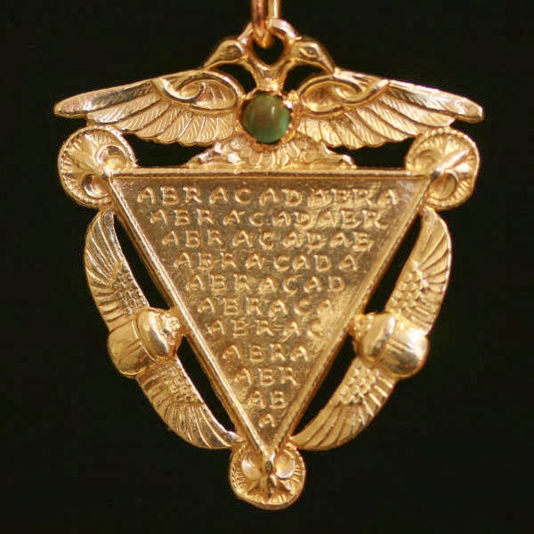

**Updated and re-written June 25 2025**

A Victorian-era penant with the Abracadabra talisman in the center.

**Abstract:** The talismanic phrase “Abracadabra” has a documented history dating back to the 2nd century CE . Despite its Latin origins, a persistent — and ultimately unfounded — belief has developed attributing its derivation to an Aramaic phrase meaning “I create as I speak.” Here we examine the history of this misattribution, the linguistic weaknesses of the proposed Aramaic etymology, and the cultural forces that contributed to its widespread acceptance.

### Introduction:

The phrase “Abracadabra” enjoys a long and fascinating history, initially appearing in the *Liber Medicinalis* by Quintus Serenus (c. 120-180 CE), also known as Sammonicus.[^1] Serenus likely intended it as a charm to alleviate a particular kind of fever.  While the talisman itself is historically documented, the explanation of its origin has suffered from persistent and erroneous claims, particularly the assertion that it is derived from an Aramaic phrase.

[^1]: _Inscribes chartae quod dicitur **abracadabra** saepius et subter repetes, sed detrahe summam et magis atque magis desint elementa figuris singula, quae semper rapies, et cetera figes, donec in angustum redigatur littera conum: his lino nexis collum redimire memento._ = "Write on a piece of paper **abracadabra**.  Then repeat this word as many times as there are letters in the word, but each time taking off a letter, so that the whole thing takes the form of a cone. This done, hang the piece of paper around the neck of the patient with a linen thread." — [Liber Medicinalis pr.1 line 935](https://latin.packhum.org/loc/1515/1/0#935)

### The Erroneous Aramaic Etymology

The purported link to Aramaic, typically presented as deriving from the phrase אברא כדברא (pronounced approximately *abra ki-dabra*), has gained considerable traction in popular culture and even influenced scholarly discourse. However, a linguistic analysis immediately reveals significant issues with this interpretation. The claim hinges on a specific verbal construction using the root ברא (to create).  

To function as the first person singular verb (I create), the form requires the form */ʾevre/* which is most commonly spelled either אברי or אברא depending upon on the system of orthography employed. Where the ב could potentially be pronounced "hard" as */b/*, the prefix on the root for this verbal form is always either /e/ or /i/ class, where the final vowel is virtually always /e/ class — which stands in contrast to the purported /a/ class vowels in */abra/*. Given how Aramaic has been transliterated in other ancient sources, it is unlikely — but possible — that */abra/* *could* represent */ʾevre/*.

The next element is the prefix כ (*/ki-/*, meaning 'as' or 'like'). This is plausible in terms of grammatical structure and is used in a variety of Jewish Aramaic languages.

The seriously problematic element lies in the proposed interpretation of the final word, דברא. 

First, the root דבר (dbr) pertains to direction or guidance in Aramaic, not speech­ — those being the verbs אמר (/amar/) or מלל (/malel/). Where this meaning *is* found in Hebrew, this was not a borrowing attested anywhere in 2nd Century Aramaic. In the whole of the Aramaic corpus, the word דבר is only found *calqued* in late Medieval Jewish Aramaic languages, far removed from Sammonicus' time and place. On its face it appears to be a noun form and, depending on the specific Aramaic dialect, as a noun potential interpretations might include "leader," "pasture," or "plunder" — none of which fits the given description. 

Additionally, if it were to function as a verb, it would necessitate a completely different inflection. Consequently, the purported Aramaic phrase is grammatically improbable and semantically convoluted.

The only probable conclusion is that this phrase does not have its origins in the Aramaic language family, which then leads us to ask the question: Why is it then associated with Aramaic?

### Historical Development of the Misattribution

The belief in an Aramaic origin is a relatively recent phenomenon with no early historical attestation. Prior to the late 19th century, explanations for "Abracadabra" primarily revolved around theories linking it to Persian origins (suggesting a connection to the deity Abraxas) or interpretations rooted in Greek terminology.  The rise of Aramaic etymologies began prominently in the 1890s, as evidenced by publications like John McClintock and James Strong’s *Cyclopaedia of Biblical, Theological, and Ecclesiastical Literature* (1891), which offered a heterogeneous array of proposed derivations, including the fusion of Persian and "Chaldee" (a general term often used to refer to Aramaic) elements.[^2] [^3]

[^2]: **Abracadabra** -- \[... Grotefend\] derives it from the Persian _Abrasax_ **_\[sic\]_** (the name of the Supreme Being) and the Chaldee **_\[Aramaic\]_** word דִּבּוּרָא (_the utterance_), so that the meaning of it is, "a divine oracle." \[...\] _See Abraxas_  (p.27) 
[^3]: **Abraxas** -- \[...\] The latest suggestion is that it is the Aramaic for זו עוקא רבא "this is the great seal" read backwards. (p.33)

The trend amplified in the early 20th century. Publications such as *Faiths of Man* (1906) continued to propose Aramaic interpretations[^4]; however, these interpretations were often speculative and lacked rigorous linguistic foundations.[^5][^6] The proliferation of Aramaic etymologies then accelerated after 1967, and the subsequent decades witnessed a remarkable explosion of these theories within printed books and magazines,[^7][^8] including the source that was later adopted by J. K. Rowling for use of the "Killing Curse" in the Harry Potter series.[^9]

[^4]: **Abraxas, Abrasax, Abracadabra, Ablathanabla, Abanathabla -** Various terms on Gnostik charms --_see Rivers of Life,_ i, p 511. \[The translations are much disputed. Probably they are Aramaic sentences: _Abrak ha dabra,_ "I bless the deed": _Ablaṭ ha nabla,_ "I give life to the corpse": _Abana thabla,_ "Thou our father leadest"-- ED.\] The Persian sun-god was seen in the Greek letters Abraxas, representing in numbers 365 -- the days of the solar year. This word, placed on an amulet or seal, exorcised evil spirits, and was explained by Semites as meaning _Abra-Sheda-bara_, "go out bad spirit out **_\[sic\]_**" \[or perhaps better, _Abrak ha āsh_ "I bless the man." -- ED.\]
[^5]: The word **ABRACADABRA** is a combination of short Aramaic words. — Occult Review (1922)
[^6]: Abracadabra, which originally is an Aramaic sentence meaning, "Fade away as this word is fading."— The Review of Religion - Volume 2
[^7]: More plausible, perhaps, is derivation from Aramaic _abhadda kedabrah_, "vanish at this word," a suitable incantation for warding off maladies. — The Saturday Review (1967)
[^8]: **Abracadabra** was a contracted quotation from the Psalmist's call on God (Ps. 144; 6) to "cast forth lightning" (in Hebrew, _b'rok barak_) to scatter the evil ... On the contrary, **abracadabra** was the actual (Aramaic or Greek) name of a powerful demon. — R. Brasch, "Strange Customs, how Did They Begin?" (1976)
[^9]: May be from the Aramaic: _Avada Kedavra_, "May the thing be destroyed." — Stephen Jay, "Abracadabra" (1977)

The emergence of the Internet further fueled this trend, particularly with the appearance of discussions on platforms like The Straight Dope message board in 1999, which is currently the earliest published reference to it on the web.[^10]  This online speculation was mistakenly attributed to authority by Rabbi Lawrence Kushner — but he wrote no such thing. These erroneous conclusions then took root in wider digital culture, spreading rapidly across social media platforms and influencing popular understanding.

[^10]: In this week's column, Cecil gives three explanations for the term "Abracadabra", but none of them is the one I had heard while growing up. I am an Orthodox Jew, and I had always been told that it comes from the Hebrew "Abra", meaning "I will create", "Ke-dabra", meaning (roughly) "as I speak"...i.e., invoking the divine powers of creation-through-speech as in Genesis. [...] A source for the "Abracadabra" etymology: in "The Book of Words" (Woodstock, VT: Jewish Lights Publishing, 1993, p. 11), Rabbi Lawrence Kushner mentions that "The Aramaic for 'I create as I speak' is avara k'dvara, or, in magician's language, abracadabra." [Editor's Note: Rabbi Kusher did not write this.]  — [Straight Dope message board, March-April 1999](http://boards.straightdope.com/sdmb/archive/index.php?t-135.html)

### Cultural and Psychological Factors

The persistence of the erroneous Aramaic etymology can be attributed to several factors. For one, the desire to connect “Abracadabra's” mysterious origins to a perceived source of ancient wisdom and spirituality likely played a significant role. The fascination with ancient languages and their potential to unlock hidden meanings also certainly contributes — who could resist a story of secret wisdom?  The echo chamber effect of Internet communication, where misinformation is readily shared and reinforced, further exacerbated the problem. And the desire to retroactively assign deeper meanings to well-known phrases — folk etymology — is a common phenomenon, especially where an origin story lacks a clear historical link.

And if I may be able to opine a bit, I firmly believe that all of these things tend to come back to the fact that we human beings are tellers of stories: Especially stories that give meaning to the mundane, and stories that fascinate us we genuinely wish to share and fascinate others in our lives. In many ways, it is what makes us truly human.

### Conclusion

In any case, the claim that "Abracadabra" is derived from an Aramaic phrase is linguistically untenable and historically unsupported.  While the phrase's origins are complex and intriguing, the connection to Aramaic is an historically recent and inaccurate attribution. A critical examination of linguistic principles demonstrates the weaknesses of the purported derivation, and an understanding of the historical and cultural forces at play can clarify why such a misconception has gained such widespread acceptance. 

In the end, it's simply a good ­story.